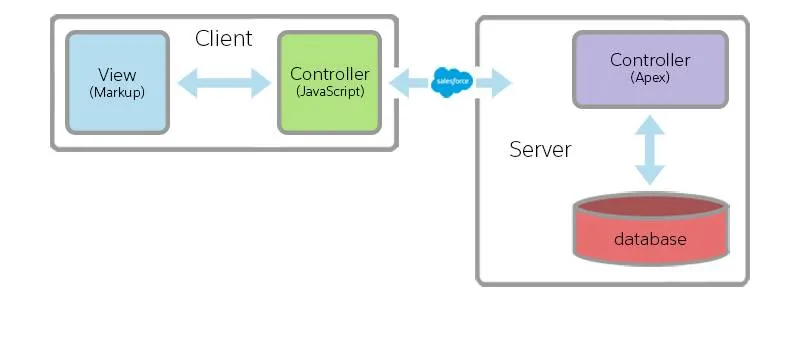

# Aura Components

## Lightning Component Framework

The Lightning Component framework is a ***UI framework*** for developing web apps for ***mobile and desktop*** devices. It’s a modern framework for building ***single-page applications*** with dynamic, responsive user interfaces for ***Lightning Platform apps***. It uses ***JavaScript*** on the client side and ***Apex*** on the server side.

**Note**: In the Aura Component programing model, a component is a *bundle* of code. It can include markup, and it can also include JavaScript code, in a number of associated resources. Related resources are “auto-wired” to each other, and together they make up the component bundle.

## Create and Edit Aura Components

After we have created our ***Aura component***, our component needs to run inside a ***container app***, which we’ll call a container for short. Examples of containers would be the Lightning Experience or Salesforce apps, or an app we build with Lightning App Builder. We add our component to one of these containers, and the access it within that container. For example, we can create one by: Select **File** | **New** | **Lightning Application** to create a new ***Lightning app***.

### What Is a Component?

In the context of our helloWorld example. 

 As a practical matter, a component is a ***bundle*** that includes a definition resource, written in markup, and may include additional, optional resources like a controller, stylesheet, and so on. A resource is sort of like a file, but stored in Salesforce rather than on a file system.

Our `helloWorld.cmp` component definition resource is easy to understand.

```xml
<aura:component>
    <p>Hello Lightning!</p>
</aura:component>
```

**What is a bundle ?**

A *bundle* is sort of like a folder. It groups the related resources for a single component. Resources in a bundle are *auto-wired* together via a naming scheme for each resource type. Auto-wiring just means that a component definition can reference its controller, helper, etc., and those resources can reference the component definition. They are hooked up to each other (mostly) automatically.

### What Is an App?

Now that we know what a component is, it’s actually easy to explain what an app is—an app is just a special kind of component

