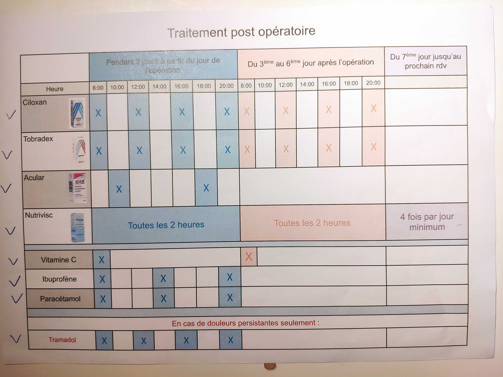
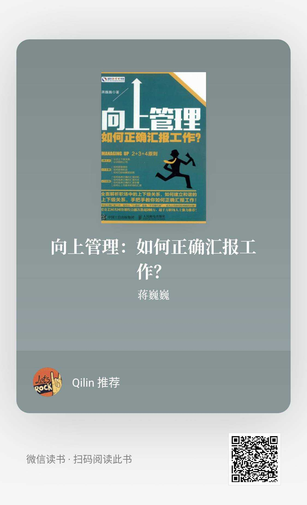
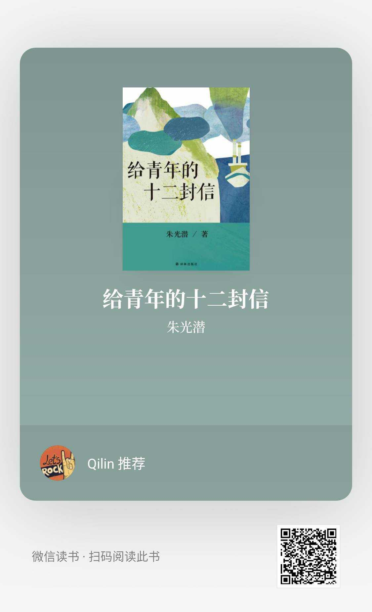
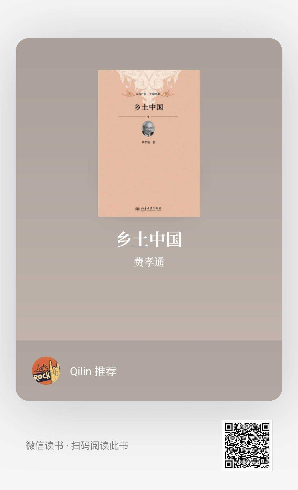
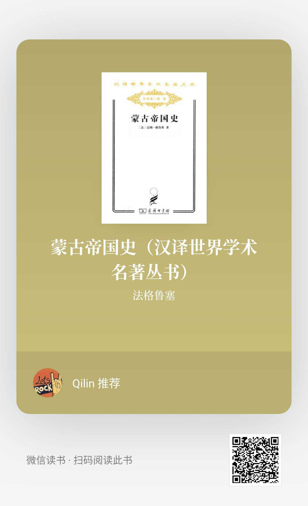

[TOC]

> 法国时间2021年9月15号上午11点30左右，我做了一个[TransPRK](https://zh.wikipedia.org/wiki/TransPRK)的近视手术，术后有5天左右几乎与外界完全隔离的术后休息时期。待到我可以看手机与外界联系时，我发现自己错过了朋友们的很多生活和日常，内心突然有些焦虑和怅然若失。适逢中秋节，谨以此文记下这5天之内的经过和一些小小的感想。
>

### 与外界几乎完全切断的三天

在做近视手术之前，我已经设想过我这三天将会怎样度过，并做好了相关计划：买了100个饺子，买了15个苹果用来获取水果中含有的营养，买了足够的牛奶和面包用来解决早餐问题，另外还有鸡蛋准备吃水煮鸡蛋了。

TransPKR手术技术手法比较传统，优点是术后视力比较稳定，缺点就是术后当天眼睛非常痛（但这之后2天内疼痛递减），以及恢复时间长，总共需要3个月彻底恢复。手术当天回来路上眼睛不停的流泪，眼睛畏光，刺痛，几乎完全不能睁开眼睛，幸好提前叫了朋友手术后和我一起坐地铁回家。

手术后回到家的过程、吃药用药的过程在此不赘述，所用药品和时间安排如下：

{:height="80%" width="80%"}

#### 听书

接下来的5天我要一个在家，并且与外界没有什么联系，也不会使用网络了。也正由于完全一个人在家，同时不能看任何屏幕，让我有了听书的时间，听一些一直打算看但由于懒惰没有去看的书，而我也却从其中得到了从未有过的宁静与自主。

从9月15号晚上一直到9月19号中午，我都过着”进食－>用药吃药－>听书－>睡觉“的简单循环中，手机只作为闹钟提醒我吃药用药和打开微信读书来使用，有消息看的模糊，只语音回复了2个人紧急的消息，

这3－4天，我陆续听了以下几本书，谈谈感想，希望感兴趣的可以去读一读：

1. 《向上管理》, 这本书很早之前朋友向我推荐过，说对工作帮助很大。一直在微信读书的书架里放着，每次开始看几章就看不进去了，现在终于听完。这本书我听得很认真，几乎一字一句，听不懂还要倒回去。内容上看，对工作应该会有帮助，希望我能灵活运用书中所讲吧。

   {:height="50%" width="50%"}

   

2. 朱光潜－《给青年的十二封信》，这是我第二遍听此书，个人觉得这十二封信的内容特别适合高中毕业到大学二年级以前的朋友们读，我这个年龄和经历读起来，新意已经不够，因为其中很多事情和道理以及逻辑都能自己理清了。

   不过，这真的是一本好书，读起来很享受。要是我以前能知道这本书多好啊，我应该会少走很多弯路，或许我会是另一个不一样的我。由此可见，读书的环境和以及见多识广真的很重要，我以前根本不知道这个世界上有这么多好书可读可看，感谢互联网的发展，把大家之间因为贫富、地域、时空所带来的差距缩小。

   比起书中的十二封信的内容，我更喜欢附录中的文章，这些文章更有深度，更加表达了朱光潜在他人生的每个时代心里所想，如果读了这本书，后面的附录一定要看。

   {:height="50%" width="50%"}

   

3. 费孝通－《乡土中国》，这也是一本放在微信读书书架里很久的书，光看作者名字就知道是一位大家，而书中内容也确实精彩。本书讲了他对中国农村社区的观察和研究，涉及了儒家思想对中国农村社区的影响，甚至对农耕文化、中国文化的影响的讨论，很有意思，由于太高深，也不是我一进能几句话讲清楚的，建议朋友们有时间可以读读。

   {:height="50%" width="50%"}

   

4. 《蒙古帝国史》，上面3本书都完整畅快地听完了，这本没听完，过程也不畅快。这也是一位朋友某一次推荐的，所以在做手术之前就有计划听这本书，可是由于这本书引用文献太多，而微信读书是连注解的每个字也要读完，所以经常碰到以下情况：(1)此处摘自《蒙古秘史》某章某页，但是与外蒙古共和国官方所修《蒙古帝国史》某处不同，《蒙古帝国史》记载为：XXXX。(2) 此处为XXXX，依此直到(50)，非常影响听众的感受和对全书进度的理解。

   {:height="50%" width="50%"}

### 如果现代人没有了网络，如果一个人不与外界联系

我就是在与外界几乎没有联系的情况下度过了4天。等到9月19号周日晚上我开始翻看微信朋友圈，但此时也因为眼睛需要休息，只能随便翻看几个，我忽然意识到：已经5天没和外界有什么联系了，刚好这周日是世界遗产日，巴黎肯定有很多活动吧？外婆70岁生日，我错过了很多与之相关的讨论和朋友圈；我的朋友们都过的怎么样？大家这几天都发生了什么？工作都怎么样了？同事在工作群里都聊了什么？以前休假的时候虽然在休假，但是我还是可以看到大家在工作群里都聊了什么。巴黎这几天有没有什么值得记住的事情我错过了？这个世界这几天发生了什么？某某地区和国家又发生了什么事？等等一切。

我突然意识到：我已经和网络深深绑定了，没有了网络，我要做的很多事情无法开展，我要获取的信息无法获取。如果一个现代人没有网络，他的生活会是怎样？我想当周围有我们需要的一切的时候，我们就无需网络吧，这个情况可能是：有自己最亲密的人在身边，朋友们都在身边，无需获取外界信息，因为朋友们会和你讲，工作也无需网络。进而我又想到，仅仅在这4－5天的我不与我之外的外界有任何联系的时间里，就让我有一种我已经从这个世界消失的感觉：这个世界如果没有我，不会有任何变化；而我如果不与外界联系，会等同于我没有在这个世界存在过，因为没有我的痕迹。

### 回到现在

在不与外界联系的那几天对我而言真是魔幻，像是在另一种不同的时空。现在，一切也终于要回归到以前一样了，不会有大把时间看工作和专业领域以外的书籍，每天很多时间面对屏幕（但是要注意用眼和眼睛的休息），每天要面对很多代码，每天要面对很多人和事，我又感觉自己在这个世界上存在了！

世事无常，珍惜身边的人和事，珍惜和热爱生活。中秋节了，祝大家节日快乐，花好月圆，千里共婵娟！
